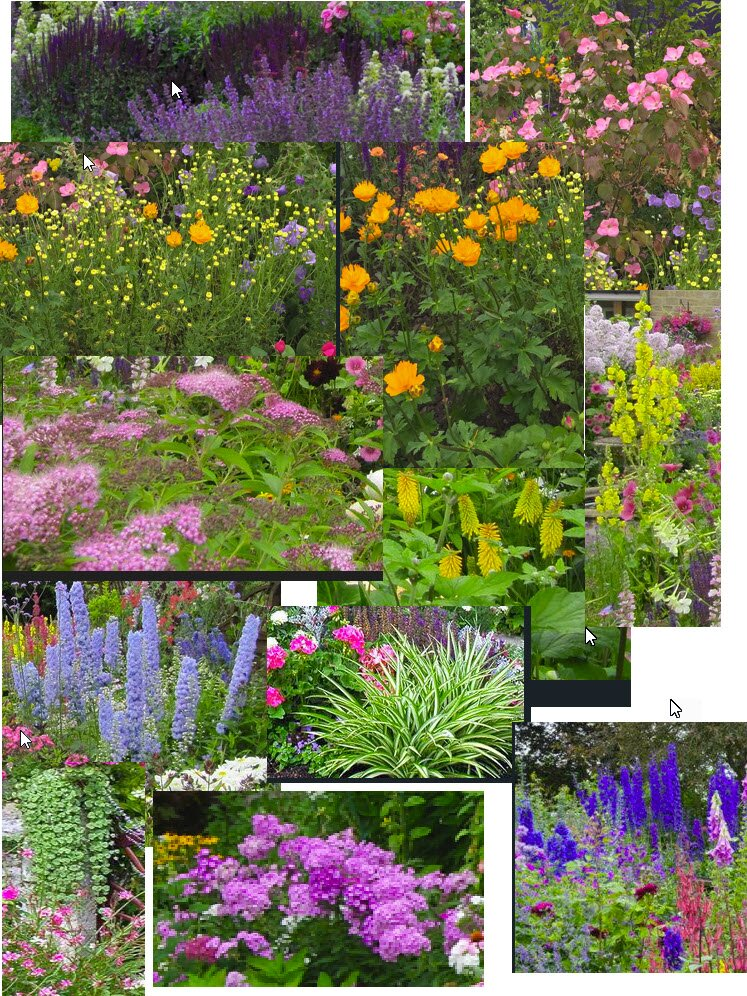

<!--
═══════════════════════════════════════════════════════════════════════════════
ENGLISH COUNTRY GARDEN PROJECT - SOURCE NARRATIVE
═══════════════════════════════════════════════════════════════════════════════

PURPOSE: This file contains the consolidated narrative about the english-country-
garden project, combining information from _projects/english-country-garden.md 
and organizing it for conversion to comprehensive project page.

This is the SOURCE OF TRUTH for the project.

DO NOT PUBLISH: This file is for documentation purposes only and should NOT be 
published to the website. It serves as the authoritative reference that AI will 
use to generate properly formatted content for the website.

WORKFLOW:
1. Content consolidated from existing project file (english-country-garden.md)
2. Organized into chronological narrative chapters
3. Marked up with validation framework indicators
4. You review and expand with additional details from memory
5. AI structures into final markdown for website
6. You review and approve AI-generated content
7. AI applies approved content to project page

CONTENT PROVENANCE:
- Base content from: _projects/english-country-garden.md (✅ VALIDATED per DOCUMENTATION-AUDIT.md)
- Scale: 1:50 (1m = 2cm) [COMPLETE]
- Dates: April 13 - November 30, 2024 [COMPLETE]
- Base Size: 25cm × 25cm [COMPLETE]
- Garden Size (at scale): 12m × 12m [COMPLETE]
- 50+ plant species documented [COMPLETE]
- 238 total images organized by phase
  - 3 base construction images (ecg-base-###.jpg)
  - 16 cottage construction images (ecg-cot-###.jpg)
  - 34 scenery/planting images (ecg-sce-###.jpg)
  - 65 gallery images (ecg-gal-###.jpg)
  - 119 reference images (research/planning)

Created: December 16, 2025
Last Updated: December 16, 2025
Validation Status: PARTIALLY VALIDATED - Needs user expansion and verification

═══════════════════════════════════════════════════════════════════════════════
-->

# ENGLISH COUNTRY GARDEN - PROJECT NARRATIVE

**Project Timeline:** April 13, 2024 - November 30, 2024 (7.5 months)  
**Scale:** 1:50 (1m in reality = 2cm in model)  
**Final Dimensions:** 30cm × 30cm base / 15m × 15m garden at scale  
**Cottage dimensions:** Approximately: 16cm height 11cm width 19cm length (roof hight 9.5m at scale)  
**Total Build Time:** Approximately 150 hours

---

## PROJECT OVERVIEW AND INSPIRATION

Coming out of my experience with the Log Cabin and Cathy's Flower House, I really wanted to practice more to make realistic miniature flowers.  The first attempts in the Log Cabin was bit of an eye opener that it would take much more practice, improved techniques and better materials. As a keen gardener, with my own beautiful garden and a huge admiration for English Country gardens, I could not select a better topic to experiment with flower making than to scratch build my own miniature garden.  

This project must capture the romantic beauty and horticultural richness of a traditional English cottage garden. The centerpiece is a historic Victorian cottage with an authentic thatched roof (approximately 11cm high), surrounded by a meticulously detailed 15m × 15m garden (at 1:50 scale).  The thatched roof was specifically included to practice and experiment something different that the slate/tiled roof of the Log Cabin.

The main focus of this build was researching and mastering techniques for creating realistic miniature flowers and plants of all kinds. The garden features over 100 different flowering plant and shrubs and a good selection of trees, each crafted to capture the unique characteristics of English cottage garden favorites.

---

## CHAPTER 1: PLANNING AND RESEARCH
**Timeline:** April 2024 

### scale and layout

Selecting the scale, as in the case of the Log Cabin, was determined by the space available to display. This was long before this site came into being. The overall scale had to be around 25cm square.  With that in mind I tried to imagine the size of the house and garden and put the following prototype together. assets\images\projects\english-country-garden\base\ecg-base-002.jpg

A footprint prototype of the house provided a better assessment of the space on the base

assets\images\projects\english-country-garden\base\ecg-base-003.jpg

Extensive research and collection of reference material kick started. Hundreds of pictures of both formal and cottage gardens, individual plant and flower displays as well as a wide range of thatched roof cottages, especially those with country style gardens were reviewed.  

### cottages

A few cottages stood out, providing the right layout and look and feel for the targeted base.

assets\images\projects\english-country-garden\planning\cottages\ecg-plan-cot-002.jpg providing a view on how the house will fit in with the small garden
assets\images\projects\english-country-garden\planning\cottages\ecg-plan-cot-003.jpg the roof and chimney of this house resonated.
assets\images\projects\english-country-garden\planning\cottages\ecg-plan-cot-010.jpg the annex and aging of this cottage appealed to me
assets\images\projects\english-country-garden\planning\cottages\ecg-plan-cot-014.jpg the house with annex, tree, path in the middle formed a an appealing combination

### flowers and plants

A large part of the driving force behind the model was making the flowers. I prepared a long list from my own garden book of all the flowers that potentially could be modelled.  I then started to document more detail about each flower, focussing on characteristics such as the flower spike or arrangement, flower base, leaf type and form, flower shape, colour varieties. Some of the plants included in this analysis included foxgloves, delphiniums, roses, hollyhocks, lavender, ferns, hostas, daisies, carea (grasses), poppies, cosmos, clematis,lilies and many more.  

These gardens were such an inspiration:

assets\images\projects\english-country-garden\planning\flowers\ecg-plan-flw-005.jpg
assets\images\projects\english-country-garden\planning\flowers\ecg-plan-flw-007.jpg
assets\images\projects\english-country-garden\planning\flowers\ecg-plan-flw-009.jpg
assets\images\projects\english-country-garden\planning\flowers\ecg-plan-flw-010.jpg

The gardens from the research was so overwhelmingly beautiful, I almost got distracted and lost in the collection of examples of all the flowers and plants.

Ii my attention had to move on to learn more on how to create these magnificent specimens, especially after my first attempt during the log cabin project demonstrated that it is not that easy. 

Trawling through the internet, botanical books and magazines, and through my own garden book in gardens4comfort.uk I collate may paper cut stencils, paint and drawing stencils and catelogs of flower shapes and types. Some pictures stood out assets\images\projects\english-country-garden\planning\training-and-references\ecg-plan-ref-011.jpg; assets\images\projects\english-country-garden\planning\training-and-references\ecg-plan-ref-015.jpg; assets\images\projects\english-country-garden\planning\training-and-references\ecg-plan-ref-016.jpg;

This inspiration got me straight into experimentation with making flowers.  Research continued to be woven into the practical construction and building. Step 1 was to get a sense for the size and scale of objects, then to imagine the broad layout to determine what type of structures would be required. Work started on making the flowers.  If I could not manage to get the flowers done, there was no use continuing with the other main parts such as the cabin. From previous experience, fitting items to the base follows making most the parts, rather than fitting each part as it is being made.  

## CHAPTER 2:  FLOWERS

Each flower was individually made, and for this materials had to be collated and made.

### material preparation

Wire: I recovered quit a bit of copper wire from wire stripping, capacitor leads and coil windings.  The grades of copper vary from Ultra-fine wire: Almost hair-thin, typically around 0.1 mm or less in diameter, fine wire: Around 0.3–0.5 mm diameter, good for delicate work like flower stems or small details, medium wire: About 0.8–1.2 mm diameter, often used for structural parts or thicker stems and heavy wire: Up to 2 mm diameter, suitable for strong frameworks or bases. I discovered how handy copper wire is in this project, and it is now indespensible in my dioramas.

To prepare, the wire is pre coated with acrylic paint or left water based paint in various darker colours to hide the copper gloss of the wires.  These are then cut into different sizes and bundled together, ready for use.  \assets\images\projects\english-country-garden\scenary\ecg-sce-035.jpg

Paper: I collected a range of different types of paper for different parts of the flowers including Standard 80 gsm printer paper (for petals and templates), packing tissue (17–35 gsm) (for soft, delicate layers) and Cardstock (160–220 gsm) (for stems, leaves, and structural parts).  Sheets of the different types of paper were colored with acrylic of a range of colours to suite the different flowers.  the sheets were all dried and then filed in a folder for easy access.

Natural materials: saw dust was sifted into different grades, and then coloured in greens, whites, pinks and reds in small quantities.  This was very useful for some of the fine cluster types of flowers.    Other materials used for leaves include, seed heads, spagnum moss and tea leaves.

### making flowers

Selecting the methods for making flowers were largely centered around shapes, illustrated well with the following
\assets\images\projects\english-country-garden\planning\training-and-references\ecg-plan-ref-014.jpg

strap shaped (daisy)
bell or funnel shaped (bluebell, arum lily)
Cluster (lavender)
spike (foxgloves, hollyhocks)
Flat top (ammi majus)
distinct petals (rose, dahlia,geum,flox,lily )
star (clematis, marygold)
saucer (butter cup, cosmos)
pompom (poppy, thissle)
trailing (rose, clematis, wisteria)

The following pictures illustrate different techiniques. Note that some of these example experimentations never made it to the garden as I discovered new tools and techniques for making similar flowers.

assets\images\projects\english-country-garden\scenary\ecg-sce-003.jpg micro cups
assets\images\projects\english-country-garden\scenary\ecg-sce-004.jpg clay, natural seed heads
assets\images\projects\english-country-garden\scenary\ecg-sce-005.jpg stencil cut
assets\images\projects\english-country-garden\scenary\ecg-sce-006.jpg paper cuts
assets\images\projects\english-country-garden\scenary\ecg-sce-007.jpg various paper cuts
assets\images\projects\english-country-garden\scenary\ecg-sce-008.jpg making spikes, cluster flowers, and stamin (centre of flowers)

A leather hole cutting tool was used to cut the micro cups, made into a cup with a small size ball scalping tool, it was glued individually to a green wire stem.

The funnel of the arum lilies were made out of clay, and folded around a wire stem dipped in yellow saw dust for the stigma.

Some of the completed fowers can be seen in these displays

 

### making leafy plants

making the leafs, especially when distinct, for both leafy plants and the base for the flowering plants all centered leaf size and shape.  Ferns were by far the most challenging, especially as at the miniaturisation I am working towards. \assets\images\projects\english-country-garden\planning\training-and-references\ecg-plan-ref-014.jpg

hostas
ferns
grasses
heleborus

###making shrubs

philadelphus

## CHAPTER 2: BASE CONSTRUCTION
**Timeline:** [TODO - User to provide dates]

[NEEDS MORE - Entire chapter needs user input]

### Foundation and Terrain

[TODO - User to provide detailed narrative:]
- What materials did you use for the base? (wood, foam, other?)
- How did you create the terrain contours?
- Were there multiple levels or elevation changes?
- How did you plan for pathways through the garden?
- What challenges did you face with the base construction?
- How long did this phase take?

**Images for this chapter:** [COMPLETE - Files identified]
- ecg-base-001.jpg [TODO - What does this show?]
- ecg-base-002.jpg [TODO - Caption needed]
- ecg-base-003.jpg [TODO - Caption needed]

### Preparing for Planting Areas

[TODO - User to add:]
- How did you designate different planting zones?
- Did you create raised beds or borders?
- How did you prepare the surface for planting?
- What texturing techniques did you use?

---

## CHAPTER 3: COTTAGE CONSTRUCTION
**Timeline:** [TODO - User to provide dates]

[NEEDS MORE - Entire chapter needs detailed user input]

### Building the Structure

[TODO - User to provide comprehensive narrative:]
- What materials did you use for the cottage walls?
- How did you build the frame/structure?
- What scale challenges did you face?
- How did you create windows and doors?
- Did you build interior details?
- Construction sequence and process?

**Images for this chapter:** [COMPLETE - 16 images identified]
- ecg-cot-001.jpg through ecg-cot-016.jpg [TODO - User to caption each phase]

### The Thatched Roof

[COMPLETE - From validated project file:]
**Thatched Roofing:** Traditional miniature thatching techniques

[TODO - User to expand dramatically - this is a major feature:]
- Which YouTube tutorial(s) did you follow for thatching?
- What materials did you use for the thatch? (natural? synthetic?)
- What was the construction technique step-by-step?
- How long did the roof take to complete?
- What challenges did you encounter?
- What tools did you use?
- How did you achieve the authentic thatched appearance?
- Any failures or do-overs during this process?
- Time investment for roof alone?

### Cottage Details and Finishing

[TODO - User to add:]
- Chimney construction (if any)
- Weathering and aging techniques
- Color choices and painting
- Any architectural details (timber framing, stone work, etc.)
- How historically accurate did you aim to be?

---

## CHAPTER 4: PLANT CREATION - THE HEART OF THE PROJECT
**Timeline:** [TODO - User to provide dates - this was 7.5 months total, when did planting work happen?]

[NEEDS MORE - This is the MAIN FOCUS - needs extensive detail]

[COMPLETE - From validated project file:]
The main focus of this build was researching and mastering techniques for creating realistic miniature flowers and plants of all kinds. The garden features over 50 different plant species.

### Plant Species Created

[COMPLETE - From validated project file:]
**Featured Plants Include:**
- Delphiniums and Foxgloves (approx. 3cm tall)
- Roses (6mm blooms at 3cm height)  
- Hollyhocks, Lavender, and Box hedging
- Hostas, Ferns, and ornamental Grasses
- Geraniums, Lobelia, Phlox, and Daisies
- Wisteria, Clematis, and climbing plants
- Conifers, Chestnut, and Birch trees
- And many more cottage garden classics

[TODO - User to add for EACH major plant type:]
For each plant family, describe:
- What materials did you use? (wire, paper, fabric, foam, natural materials?)
- What techniques did you develop or learn?
- Which were easiest? Which were most challenging?
- How long did each type take to create?
- How many of each did you make?
- Any specific tutorials or techniques you followed?

**Example questions for specific plants:**

**Roses:**
- How did you achieve 6mm blooms at 3cm height?
- What material for petals?
- How did you create the layered petal effect?
- Color mixing for different rose varieties?
- Techniques for buds vs. open blooms?

**Delphiniums/Foxgloves:**
- How did you create the tall flower spikes?
- Techniques for individual bell-shaped flowers?
- Color gradation along the spike?

**Wisteria/Clematis:**
- How did you create climbing/trailing effect?
- Support structures?
- Techniques for cascading blooms?

**Trees (Conifers, Chestnut, Birch):**
- Construction methods for each type?
- Foliage techniques?
- Scale-appropriate branch structure?

### Techniques Mastered

[COMPLETE - From validated project file:]
- **Miniature Flower Creation:** Multiple techniques for different flower types and shapes
- **Foliage and Leaf Work:** Various methods for creating realistic leaves and greenery
- **Plant Stenciling:** Using stencils and templates for consistent flower shapes
- **Color Mixing:** Achieving natural plant colors and seasonal variations

[TODO - User to expand each technique:]
- Specific materials and tools for each technique
- Step-by-step process descriptions
- What worked best? What didn't work?
- Time investment in mastering each technique
- Any innovations or personal discoveries?

### Materials and Suppliers

[TODO - User to provide:]
- What materials did you use for flower making?
  - Paper types?
  - Wire gauges?
  - Paints and colors?
  - Adhesives?
  - Natural materials?
  - Synthetic materials?
- Where did you source specialized materials?
- What tools were essential?
- Approximate material costs?

---

## CHAPTER 5: SCENERY AND PLANTING
**Timeline:** [TODO - User to provide dates]

[NEEDS MORE - Entire chapter needs detailed user input]

### Creating the Garden Composition

[COMPLETE - From validated project file:]
- **Scenic Layering:** Building depth through layered plantings
- **Terrain Building:** Creating natural-looking ground contours and planting beds
- **Natural Landscaping:** Realistic terrain with varied elevations, pathways, and planting areas
- **Seasonal Color:** Achieved the vibrant, layered color palette characteristic of English cottage gardens
- **Scale Accuracy:** Maintained proper 1:50 scale throughout

[TODO - User to expand:]
- How did you plan the planting layout?
- What was your approach to achieving the "informal, densely-planted" cottage garden aesthetic?
- How did you create depth and layering?
- Pathway construction and materials?
- Ground cover techniques?
- How did you achieve varied elevations in the beds?
- What challenges did you face with plant placement?
- How many times did you rearrange plants before finalizing?

**Images for this chapter:** [COMPLETE - 34 images identified]
- ecg-sce-001.jpg through ecg-sce-034.jpg [TODO - User to caption each phase]

### Border and Hedge Creation

[TODO - User to add:]
- Box hedging technique and materials
- Creating borders and edging
- Pathways between beds
- Any fencing or garden structures?

### Color Palette and Seasonal Appearance

[TODO - User to add:]
- How did you decide on the color scheme?
- Were you going for specific season (spring, summer)?
- Color mixing and painting techniques
- How did you achieve color harmony across 50+ species?
- Any color combinations you're particularly proud of?

---

## CHAPTER 6: GARDEN DETAILS AND ACCESSORIES
**Timeline:** [TODO - User to provide dates]

[NEEDS MORE - User to provide all detail]

### Garden Tools and Accessories

[COMPLETE - From validated project file:]
- **Garden Tools and Accessories:** Creating scale-appropriate garden elements

[TODO - User to expand:]
- What garden tools did you create? (rake, spade, wheelbarrow, watering can?)
- What materials did you use?
- How did you achieve 1:50 scale accuracy?
- Any furniture (garden bench, chair)?
- Decorative elements (bird bath, sundial, pots, planters)?
- How long did accessories take?

**Reference images available:**
- Garden-tools: 3 reference images

### Final Detailing

[TODO - User to add:]
- Any small details added (butterflies, bees, garden ornaments)?
- Mulch or ground scatter materials?
- Stone or gravel pathways?
- Any water features?
- Weathering and aging of cottage and garden elements?

---

## CHAPTER 7: WEATHERING AND FINISHING
**Timeline:** [TODO - User to provide dates leading to Nov 30, 2024 completion]

[NEEDS MORE - User to provide all detail]

### Weathering the Cottage

[COMPLETE - From validated project file:]
- **Weathering and Aging:** Giving the cottage and garden a lived-in appearance

[TODO - User to expand:]
- What weathering techniques did you use on the cottage?
- How did you age the thatched roof?
- Moss or lichen effects on cottage walls?
- Dirt and wear around doorways?
- Window aging and weathering?
- Paint weathering techniques?

### Garden Weathering and Natural Effects

[TODO - User to add:]
- How did you weather garden elements?
- Natural growth and wild appearance techniques?
- Aging pathways and edging?
- Tools weathering?
- Creating "lived-in" garden atmosphere?

### Final Photography

[COMPLETE - 65 gallery images identified]
- ecg-gal-001.jpg through ecg-gal-065.jpg

[TODO - User to add:]
- How did you approach final photography?
- Any special lighting or backgrounds?
- What angles best showed the garden?
- How many photo sessions?
- Any post-processing?
- Which shots are you most proud of?

---

## PROJECT STATISTICS AND REFLECTIONS

### Time Investment

[TODO - User to provide:]
- Total build time: [TODO - provide total hours]
- Planning and research: [TODO]
- Base construction: [TODO]
- Cottage construction: [TODO]
- Thatched roof: [TODO]
- Plant creation: [TODO]
- Planting and scenery: [TODO]
- Detailing and finishing: [TODO]

**Build dates:** [COMPLETE]
- Start: April 13, 2024
- Completion: November 30, 2024
- Total duration: 7.5 months (231 days)

### Materials Summary

[TODO - User to provide:]
- Major materials used
- Approximate costs
- Any recycled or repurposed materials?
- Specialty materials that were essential

### Technical Specifications

[COMPLETE - From validated project file:]
- **Scale:** 1:50 (1m = 2cm)
- **Base Size:** 25cm × 25cm
- **Garden Size (at scale):** 12m × 12m (scaled real-world garden)
- **Cottage Height:** Approximately 10cm (~5m at scale)
- **Rose bloom size:** 6mm
- **Rose height:** 3cm
- **Tall perennials (Delphiniums/Foxgloves):** Approx. 3cm tall
- **Plant Species:** 50+ different varieties
- **Difficulty:** Advanced

### Challenges and Solutions

[TODO - User to provide:]
What were your biggest challenges and how did you overcome them?

**Possible challenges to address:**
- Scale consistency across 50+ plant species?
- Achieving realistic flower appearance?
- Thatched roof construction?
- Creating convincing cottage garden aesthetic?
- Time management over 7.5 months?
- Material sourcing?
- Technique mastery?

### Learning and Skills Developed

[COMPLETE - From validated project file, but needs expansion:]
- Miniature flower creation (multiple techniques)
- Foliage and leaf work
- Plant stenciling
- Color mixing for natural plant colors
- Thatched roofing techniques
- Cottage construction
- Terrain building
- Scenic layering
- Weathering and aging

[TODO - User to expand:]
- Which skill was hardest to master?
- Which skill are you most proud of developing?
- What would you do differently?
- What techniques will you use in future projects?
- Any unexpected skills you developed?

### Personal Reflections

[TODO - User to provide:]
- How does the finished project compare to your initial vision?
- What are you most proud of?
- What surprised you during the build?
- Would you build another cottage garden?
- How has this project influenced your modeling approach?
- Any regrets or things you'd change?

---

## CONTENT VALIDATION STATUS

### ✅ VALIDATED SECTIONS (from english-country-garden.md):
- Scale: 1:50 ✓
- Base Size: 25cm × 25cm ✓
- Garden size at scale: 12m × 12m ✓
- Project dates: April 13 - Nov 30, 2024 ✓
- Completion status: Completed ✓
- Cottage height: ~10cm ✓
- 50+ plant species (list provided) ✓
- Techniques list ✓
- Research areas documented ✓
- Training resources mentioned (YouTube tutorials) ✓
- Difficulty level: Advanced ✓
- Rose specifications: 6mm blooms, 3cm height ✓
- Tall perennials: ~3cm ✓

### ⚠️ PARTIALLY VALIDATED - NEEDS USER EXPANSION:
- Project inspiration story (generic description provided, personal story needed)
- Research phase details (categories listed, specifics needed)
- Build phases (structure outlined, narrative needed)
- Techniques (listed but not detailed)
- Material specifics (general categories, not specific products/methods)

### ❌ NOT YET VALIDATED - USER INPUT REQUIRED:
- Complete chapter narratives for all 7 chapters
- Specific dates for each build phase
- Time investment breakdown
- Detailed technique descriptions
- Material and supplier information
- Specific YouTube tutorial references
- Step-by-step construction processes
- Personal anecdotes and challenges
- Problem-solving stories
- Photo captions for all 53 build images
- Detailed reflections and learning moments

### IMAGE INVENTORY:
✅ **All image files identified and organized:**
- Base: 3 images (ecg-base-001 to 003)
- Cottage: 16 images (ecg-cot-001 to 016)
- Scenery: 34 images (ecg-sce-001 to 034)
- Gallery: 65 images (ecg-gal-001 to 065)
- References: 119 images across 7 categories
- **Total: 238 images**

❌ **Captions needed for all 53 build process images**

---

## NEXT STEPS FOR USER:

1. **Review this consolidated narrative** - Verify all validated content is accurate
2. **Expand [TODO] sections** - Add your personal memories and details
3. **Expand [NEEDS MORE] sections** - Add depth to existing content
4. **Caption images** - Describe what each of the 53 build images shows
5. **Add timelines** - Provide specific dates for each chapter/phase
6. **Time tracking** - Estimate hours spent on each phase
7. **Personal stories** - Add challenges, solutions, learning moments
8. **Technical details** - Expand on materials, techniques, processes
9. **Mark completed sections** with [COMPLETE]
10. **Review AI-organized structure** - Verify chapter organization makes sense

Once you've expanded the narrative, mark sections as [COMPLETE] and AI will convert to final markdown format for the website.

---

*Source narrative created: December 16, 2025*  
*Status: Awaiting user expansion and validation*  
*Next: User reviews and adds personal narrative details*
